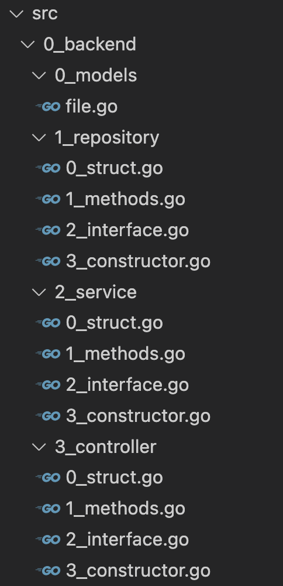

# Go gin & Typescript React project template

Go의 Gin을 이용한 Rest-full Api 템플릿입니다. 
* models - repository - service - controller 구조
* 각 클래스의 내부 의존 관계
  * struct <- method <- interface <- constructor
* Singleton 디자인의 GoORM 객체
* 빌드된 React의 정적 페이지를 Go Gin이 API와 함께 라우팅 (간단한 관리페이지 작성용)
* swagger를 활용한 API 문서화
* vscode dev container를 활용한 독립적 작업환경 구성

<div align="center"></div>

## frontend
```bash
cd /root/workdir/src/1_frontend

yarn i

# for debug
yarn start

# for build
yarn build
```

## backend
```bash
cd /root/workdir/src

# for debug
go run .

# for build
go build .
```

